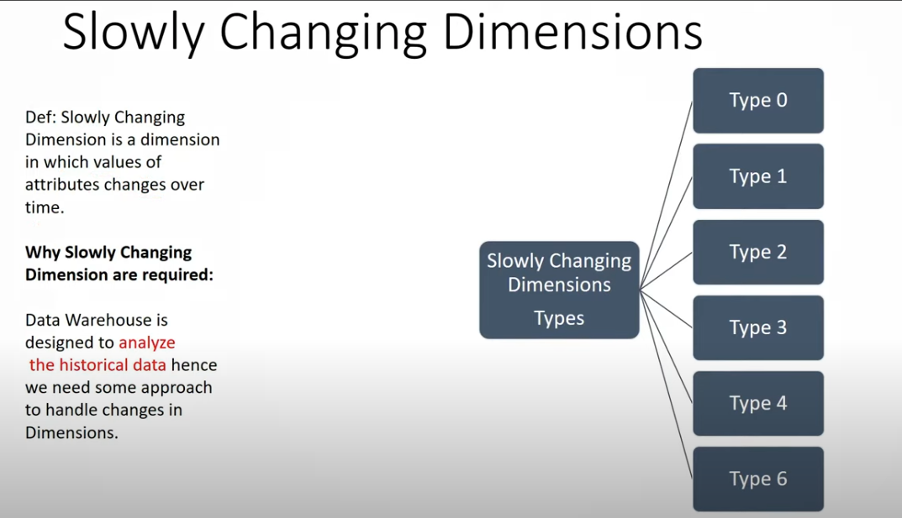
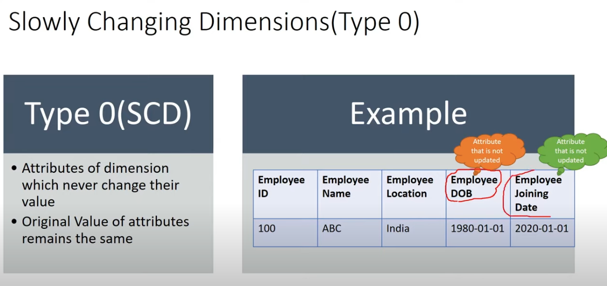
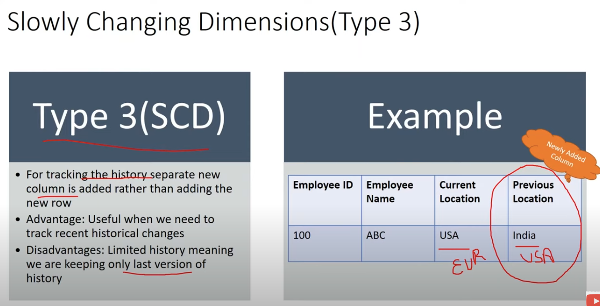
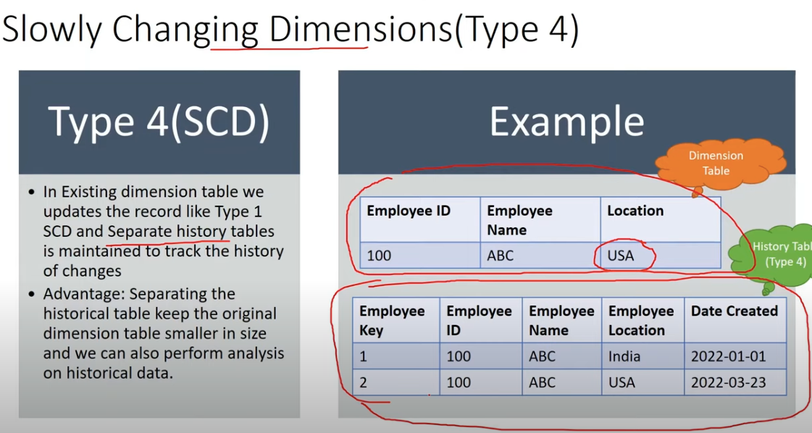
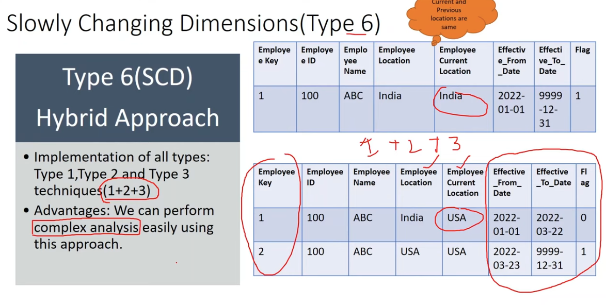
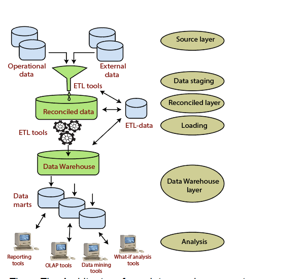
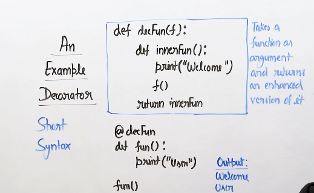

SCD (slowly changing dimensions)

scd - slowly changing dimensions is a dimension in which values of attributes changes over time.

why scd are required - data warehouse is designed to analyze the historical data hence we need some approach to handle changes in dimension 

# What is a Slowly Changing Dimension?

A Slowly Changing Dimension (SCD) is a dimension that stores and manages both current and historical data over time in a data warehouse. It is considered and implemented as one of the most critical ETL tasks in tracking the history of dimension records.

There are three types of SCDs and you can use Warehouse Builder to define, deploy, and load all three types of SCDs.

# scd0 - The values in the dimension are fixed and do not change over time. 

# scd1 - The old value is overwritten by the new value, and no history is retained.

# scd2 - A new row is added for each change, keeping a history of changes over time. Each record typically includes an effective_date and expiration_date to track validity periods.

# scd3 - Instead of adding new rows, a new column is added to track the previous values. This approach allows limited historical tracking (typically one or two changes).

# scd4 - The main dimension table holds only current data, and a separate history table records changes.

# scd6 - Combines elements of Types 1, 2, and 3 to track the current state, recent history, and full historical records.

# What are the three types of SCDs?

The three types of SCDs are:

Type 1 SCDs - Overwriting

In a Type 1 SCD the new data overwrites the existing data. Thus the existing data is lost as it is not stored anywhere else. This is the default type of dimension you create. You do not need to specify any additional information to create a Type 1 SCD.

Type 2 SCDs - Creating another dimension record

A Type 2 SCD retains the full history of values. When the value of a chosen attribute changes, the current record is closed. A new record is created with the changed data values and this new record becomes the current record. Each record contains the effective time and expiration time to identify the time period between which the record was active.

Type 3 SCDs - Creating a current value field

A Type 3 SCD stores two versions of values for certain selected level attributes. Each record stores the previous value and the current value of the selected attribute. When the value of any of the selected attributes changes, the current value is stored as the old value and the new value becomes the current value.

Note: SCD Type 2 and 3 are available with the Enterprise ETL option of OWB 10gR2. With Core ETL features, SCD Type 1, that is, Do not keep history option, is only available.

You cannot create a Type 2 or Type 3 slowly changing dimension if the type of storage is MOLAP.

In data warehousing, slowly changing dimensions (SCDs) refer to how dimensions (descriptive attributes in data models) can change over time. There are several types of SCDs, each handling these changes differently based on business requirements for historical data preservation and update frequency.

Here's a rundown of the main types of SCDs with examples:

1. SCD Type 0 (Fixed Dimensions)
Definition: The values in the dimension are fixed and do not change over time. This type is rare as most data evolves, but some dimensions may not need any updates.
Use case: When a historical record must not change under any circumstances (e.g., an initial product release date).
Example:
Dimension: Product
Attribute: Product release date
Once set, the release date doesn’t change.
2. SCD Type 1 (Overwrite)
Definition: The old value is overwritten by the new value, and no history is retained.
Use case: When historical accuracy is unnecessary, and only the most current value is needed (e.g., minor corrections).
Example:
Dimension: Customer
Attribute: Customer email address
If the customer’s email changes, the old email is overwritten with the new one.
3. SCD Type 2 (Add New Row)
Definition: A new row is added for each change, keeping a history of changes over time. Each record typically includes an effective_date and expiration_date to track validity periods.
Use case: When a history of changes is essential, as with attributes that affect reporting (e.g., customer address changes).
Example:
Dimension: Employee
Attributes: Employee name, department, start date, end date
When an employee changes departments, a new row is added with the new department, and the old row’s end_date is updated.
4. SCD Type 3 (Add New Column)
Definition: Instead of adding new rows, a new column is added to track the previous values. This approach allows limited historical tracking (typically one or two changes).
Use case: When tracking a limited history of changes, such as when only the immediate previous value is needed.
Example:
Dimension: Customer
Attributes: Current address, previous address
When the customer changes address, the current address is moved to the previous address column, and the new address is added to the current address column.
5. SCD Type 4 (History Table)
Definition: The main dimension table holds only current data, and a separate history table records changes.
Use case: When maintaining current data in a compact dimension table, while still preserving a full history.
Example:
Dimension: Product
Main Table: Holds current product details
History Table: Stores each change in product attributes over time, like price changes or feature updates.
6. SCD Type 6 (Hybrid: Type 1 + Type 2 + Type 3)
Definition: Combines elements of Types 1, 2, and 3 to track the current state, recent history, and full historical records.
Use case: When a robust history tracking mechanism is required for complex scenarios.
Example:
Dimension: Employee
Attributes: Current department, previous department, history of department changes with effective dates
Each time the employee’s department changes, the new value is updated in the current department, the previous department is moved, and a new row with the effective date is added to the history table.
These types allow data architects to balance storage requirements, data accuracy, and historical tracking needs.

CREATE OR REPLACE TABLE stage_employees (
	employee_id INT,
	name VARCHAR,
	title VARCHAR,
	birthday DATE,
	email VARCHAR,
	phone VARCHAR
);

INSERT INTO stage_employees (
	employee_id,
	name,
	title,
	birthday,
	email,
	phone
) VALUES (
	477379,
	'Emily Verplank',
	'Manager',
	'1989-07-28',
	'everplank@gmail.com',
	'928-652-9704'
);

# Now, we can use Snowflake’s MERGE functionality to “upsert” the existing record.

MERGE INTO employees USING stage_employees 
	ON employees.employee_id = stage_employees.employee_id
	WHEN MATCHED THEN UPDATE SET
		employees.name = stage_employees.name,
		employees.title = stage_employees.title,
		employees.email = stage_employees.email,
		employees.phone = stage_employees.phone
	WHEN NOT MATCHED THEN INSERT (
		employee_id,
		name,
		title,
		birthday,
		email,
		phone
	) VALUES (
		stage_employees.employee_id,
		stage_employees.name,
		stage_employees.title,
		stage_employees.birthday,
		stage_employees.email,
		stage_employees.phone
);

# What data warehouse schema you have used? 

"Star Schema: This schema consists of one or more fact tables referencing any number of dimension tables. It's suitable for scenarios where there's a central fact surrounded by several dimensions. This schema facilitates simpler queries and is often preferred for its ease of understanding and performance.

Snowflake Schema: Similar to the star schema but with normalized dimension tables. This allows for more efficient use of storage space as it eliminates redundant data, but can potentially introduce more complexity in queries due to the need for joins across multiple dimension tables.

Galaxy Schema: An extension of the star and snowflake schemas where multiple fact tables share dimension tables. This can be useful when there are multiple related fact tables and dimensions, reducing redundancy and promoting consistency.

Fact Constellation Schema: Also known as the galaxy schema, it consists of multiple fact tables sharing dimension tables. This schema is suitable for complex analytics scenarios where there are multiple interrelated fact tables, each capturing different aspects of the business."

# What is the difference between star and snowflake Schema?

"The main difference between star and snowflake schemas lies in how they organize dimension tables:

Star Schema:

In a star schema, dimension tables are denormalized and directly connected to the fact table.
All the dimension tables are linked directly to the fact table, forming a star-like structure, hence the name.
This simplifies queries as there are fewer joins required to retrieve data.
Star schemas are generally easier to understand and maintain.
Snowflake Schema:

In a snowflake schema, dimension tables are normalized, meaning they are broken down into multiple related tables.
Each level of hierarchy in a dimension is represented by a separate table, leading to a branching or snowflake-like structure.
This normalization reduces redundancy in the data, potentially saving storage space.
However, it can lead to more complex queries as it requires joining across multiple dimension tables to retrieve data.
In summary, while star schemas are simpler and more denormalized, snowflake schemas are more normalized and can save storage space but may require more complex queries due to the additional joins across multiple dimension tables. The choice between the two depends on factors such as query performance requirements, ease of maintenance, and storage considerations."

# Help me with performance example of star and snowflake schema

"Scenario:
Imagine you're working for a retail company that sells products through multiple channels (e.g., online, in-store) and wants to analyze sales data for decision-making purposes. You have a fact table called ""Sales"" that contains sales transactions, and dimension tables for products, customers, and sales channels.

Star Schema Performance Example:
In a star schema, each dimension table is directly linked to the fact table, forming a star-like structure. When querying sales data, you only need to join the fact table with the necessary dimension tables. For example, if you want to analyze sales by product category and customer demographics, you would join the ""Sales"" table with the ""Products"" and ""Customers"" dimension tables.

Performance benefits:

Fewer joins: Since dimension tables are denormalized, there are fewer joins required to retrieve data, resulting in faster query performance.
Simplified query execution: The simplicity of the schema makes it easier for the database optimizer to generate efficient query execution plans.
Snowflake Schema Performance Example:
In a snowflake schema, dimension tables are normalized, meaning they are broken down into multiple related tables. For instance, the ""Products"" dimension might be split into separate tables for product categories, subcategories, and brands.

Performance considerations:

Increased join complexity: To retrieve sales data in a snowflake schema, you may need to join the fact table with multiple dimension tables and their related tables. For example, to analyze sales by product category, you might need to join the ""Sales"" table with the ""Product Categories"" table, which in turn might require additional joins with subcategories or brands tables.
Potentially slower performance: The additional joins in a snowflake schema can lead to longer query execution times compared to a star schema, especially for complex analytical queries.
Performance Comparison:
In scenarios where queries primarily involve retrieving aggregated data (e.g., total sales by product category), the star schema typically outperforms the snowflake schema due to its simpler structure and fewer joins. However, in cases where there's a need for highly normalized data or when storage space is a concern, the snowflake schema's benefits may outweigh its performance implications.

In summary, while the star schema generally offers better query performance for analytical workloads with fewer joins, the snowflake schema provides benefits in terms of data normalization and storage efficiency, albeit at the potential cost of slightly slower query performance due to increased join complexity. The choice between the two depends on the specific requirements and priorities of the project."

# What other Schema you have used?

"Galaxy Schema: Also known as a fact constellation schema, it extends the star and snowflake schemas by allowing multiple fact tables to share dimension tables. This schema is suitable for complex analytical scenarios where there are multiple interrelated fact tables, each capturing different aspects of the business.

Data Vault Schema: This schema is designed with a focus on historical data and auditability. It consists of three main types of tables: Hubs (containing unique business keys), Links (associations between business keys), and Satellites (historical data related to hubs and links). Data vault is particularly suitable for environments requiring extensive audit trails and data lineage tracking.

Anchor Modeling: Anchor modeling is a flexible schema approach that combines elements of both relational and graph databases. It uses anchors (which represent business entities) and attribute clusters (which represent properties of those entities) to model data. Anchor modeling is useful for scenarios where there's a need for flexibility in data structure and relationships.

Dimensional Modeling: While not a specific schema per se, dimensional modeling is a data modeling technique often used in data warehousing. It involves designing fact and dimension tables to optimize query performance for analytical workloads. Dimensional modeling typically includes concepts such as star and snowflake schemas, as well as techniques like slowly changing dimensions (SCDs) for handling historical data changes.

Columnar Storage: Again, not a schema in itself, but a storage format optimized for analytical queries. Data is stored in columns rather than rows, allowing for better compression and faster query performance, especially for analytics workloads. Columnar storage can be used in conjunction with various schema designs to further improve performance."

# How Snowflake schema is different from Star?

"The main difference between a snowflake schema and a star schema lies in the organization of dimension tables:

Star Schema:

In a star schema, dimension tables are denormalized and directly connected to the fact table.
All dimension tables are linked directly to the fact table, forming a star-like structure.
This simplifies queries as there are fewer joins required to retrieve data.
Star schemas are generally easier to understand and maintain.
Snowflake Schema:

In a snowflake schema, dimension tables are normalized, meaning they are broken down into multiple related tables.
Each level of hierarchy in a dimension is represented by a separate table, leading to a branching or snowflake-like structure.
This normalization reduces redundancy in the data, potentially saving storage space.
However, it can lead to more complex queries as it requires joining across multiple dimension tables to retrieve data.
In summary:

Star Schema: Denormalized structure with dimension tables directly connected to the fact table, forming a star-like shape. Simplifies queries but may lead to redundancy.

Snowflake Schema: Normalized structure with dimension tables split into multiple related tables, leading to a snowflake-like branching structure. Reduces redundancy but may require more complex queries due to additional joins.

The choice between a star schema and a snowflake schema depends on factors such as query performance requirements, ease of maintenance, storage considerations, and the complexity of the data model."

# Did you ever designed any DAta modela and which schema you have created?

"Yes, as a data engineer, I've been involved in designing various data models tailored to specific business needs. Depending on the requirements of the project, I've created different schema types, including:

Star Schema: One of the most commonly used schemas, particularly suitable for simple and straightforward analytics requirements. In projects where the focus is on ease of querying and performance optimization, I've often designed star schemas. These schemas streamline data retrieval by directly connecting dimension tables to the fact table, forming a star-like structure.

Snowflake Schema: In scenarios where data normalization and storage efficiency are prioritized, I've designed snowflake schemas. By breaking down dimension tables into multiple related tables, this schema reduces redundancy and promotes data integrity. While snowflake schemas may introduce additional complexity due to increased join operations, they are beneficial for projects where storage optimization is critical.

Galaxy Schema: For projects involving complex analytical scenarios with multiple interrelated fact tables, I've utilized galaxy schemas, also known as fact constellation schemas. These schemas allow multiple fact tables to share dimension tables, enabling comprehensive analysis across different business aspects. Galaxy schemas strike a balance between simplicity and flexibility, accommodating diverse analytical requirements."

# what is Fact Constellation Schema? 

Galaxy Schema: For projects involving complex analytical scenarios with multiple interrelated fact tables, I've utilized galaxy schemas, also known as fact constellation schemas. These schemas allow multiple fact tables to share dimension tables, enabling comprehensive analysis across different business aspects. Galaxy schemas strike a balance between simplicity and flexibility, accommodating diverse analytical requirements.

# What is a constraint in SQL?

"NOT NULL - Ensures that a column cannot have a NULL value
UNIQUE - Ensures that all values in a column are different
PRIMARY KEY - A combination of a NOT NULL and UNIQUE. Uniquely identifies each row in a table
FOREIGN KEY - Prevents actions that would destroy links between tables
CHECK - Ensures that the values in a column satisfies a specific condition
DEFAULT - Sets a default value for a column if no value is specified
CREATE INDEX - Used to create and retrieve data from the database very quickly"

# What is data Integrity?

"Data integrity refers to the accuracy, consistency, and reliability of data stored in a database. It ensures that the data is valid, complete, and trustworthy throughout its lifecycle, from creation to storage and retrieval. Data integrity is maintained through various mechanisms, including constraints, validation rules, and error-checking procedures, to prevent unauthorized access, data corruption, or loss.

Maintaining data integrity is essential for ensuring the reliability and accuracy of information stored in a database. It helps prevent data errors, inconsistencies, and inaccuracies, which can lead to incorrect decision-making, financial losses, or legal issues. By enforcing data integrity, organizations can trust that their data is accurate, consistent, and reliable, supporting informed decision-making and business operations."

# What is Auto Increment?

"Auto-increment is a feature in databases that automatically generates a unique numeric value for a column whenever a new row is inserted into a table. This generated value typically serves as a primary key for the table, ensuring that each row has a unique identifier.

In SQL databases, the auto-increment feature is commonly implemented using an identity column (e.g., in SQL Server) or a serial column (e.g., in PostgreSQL). When a new row is inserted into a table with an auto-increment column, the database automatically assigns the next sequential integer value to that column, starting from an initial value (e.g., 1) and incrementing by a specified increment value (e.g., 1)."

# what is ACID property?

"ACID is an acronym that stands for Atomicity, Consistency, Isolation, and Durability. It is a set of properties that guarantee the reliability and consistency of transactions in database systems. These properties ensure that database transactions are processed reliably in a way that preserves data integrity, even in the event of system failures or concurrent access by multiple users.

Let's break down each of the ACID properties:

Atomicity: Atomicity ensures that a transaction is treated as a single unit of work that is either executed completely or not executed at all. In other words, if any part of the transaction fails, the entire transaction is rolled back to its original state, ensuring that the database remains consistent. Atomicity is typically implemented using transaction logs and rollback mechanisms.

Consistency: Consistency ensures that the database remains in a consistent state before and after the execution of a transaction. This means that transactions must adhere to all defined rules, constraints, and validations, preserving the integrity of the data and enforcing any business rules. Consistency is maintained by enforcing constraints, triggers, and referential integrity rules defined in the database schema.

Isolation: Isolation ensures that the execution of one transaction is isolated from the effects of other concurrent transactions, preventing interference or data corruption caused by concurrent access to shared data. Each transaction should operate independently of other transactions, and the effects of uncommitted transactions should not be visible to other transactions until they are completed. Isolation is typically achieved through locking mechanisms and concurrency control algorithms.

Durability: Durability guarantees that once a transaction is committed, its effects are permanent and will not be lost, even in the event of system failures such as crashes or power outages. Committed transactions are stored permanently in the database, typically through mechanisms like write-ahead logging and transaction logging, ensuring that the changes are preserved even if the system crashes or needs to be restarted.

Together, the ACID properties provide a framework for ensuring the reliability, consistency, and durability of database transactions, making them essential for maintaining data integrity and reliability in modern database management systems. These properties are fundamental for ensuring that database systems can recover from failures and provide consistent and reliable service to users."

# What is difference between data warehouse, data mart and data lake?

"Here's a concise comparison of data warehouse, data mart, and data lake:

Data Warehouse:

Centralized repository for structured, processed, and historical data from various sources.
Designed for querying and analysis to support decision-making.
Typically uses a structured schema like star or snowflake.
Data is cleansed, transformed, and organized for specific analytics purposes.
Used for enterprise-wide reporting and analysis.
Data Mart:

Subset of a data warehouse focused on a specific business function, department, or user group.
Contains a subset of data warehouse data tailored to meet the needs of a particular audience.
Often designed with a dimensional schema optimized for specific types of queries.
Provides faster access to relevant data for specific user groups or departments.
Can be created to address specific business requirements or analytical needs.
Data Lake:

Centralized repository that stores structured, semi-structured, and unstructured data at scale.
Designed to store raw, unprocessed data from diverse sources without the need for a predefined schema.
Supports a wide range of data types and formats, including text, images, videos, and log files.
Provides flexibility for exploratory analysis, machine learning, and big data processing.
Allows for storing large volumes of data cost-effectively and enables data discovery and analytics across diverse data sets.
In essence:

Data warehouses are structured repositories for processed data, optimized for querying and analysis.
Data marts are subsets of data warehouses, focusing on specific business functions or user groups.
Data lakes are scalable repositories for raw, diverse data types, supporting exploratory analysis and big data processing."

# What is the difference between OLTP vs OLAP?

"OLTP (Online Transaction Processing):

Purpose: OLTP systems are designed for managing transactional data generated by day-to-day business operations.
Focus: They prioritize the efficient processing of high volumes of short, atomic transactions (e.g., insert, update, delete) in real-time.
Data Model: OLTP systems typically use normalized data models to minimize redundancy and ensure data consistency.
Schema: The schema in OLTP systems is typically normalized to reduce redundancy and support efficient transaction processing.
Queries: OLTP queries are simple, focused on retrieving or modifying individual records, and optimized for speed.
Concurrency: OLTP systems need to support high levels of concurrency to handle multiple users concurrently accessing and modifying data.
Examples: Online banking systems, retail point-of-sale systems, airline reservation systems.
OLAP (Online Analytical Processing):

Purpose: OLAP systems are designed for analyzing and querying large volumes of historical data to support decision-making and business intelligence.
Focus: They prioritize complex analytical queries that involve aggregating, slicing, dicing, and drilling down into data to gain insights.
Data Model: OLAP systems often use denormalized or star/snowflake schema data models optimized for analytical queries.
Schema: The schema in OLAP systems is typically denormalized or dimensional, enabling faster query performance for complex analytical queries.
Queries: OLAP queries are complex and involve aggregations, grouping, filtering, and slicing operations to analyze data from multiple dimensions.
Concurrency: OLAP systems generally have fewer concurrent users compared to OLTP systems, but they handle more complex and resource-intensive queries.
Examples: Data warehouses, business intelligence systems, executive dashboards.
In summary:

OLTP systems focus on efficient transaction processing for day-to-day business operations.
OLAP systems focus on complex analytical processing for querying and analyzing large volumes of historical data to support decision-making and business intelligence.
OLTP systems prioritize speed and concurrency, while OLAP systems prioritize complex analytical queries and data analysis."

# What is the difference between ELT vs ETL?

"ELT (Extract, Load, Transform) and ETL (Extract, Transform, Load) are both processes used to move and process data from various sources into a target destination, such as a data warehouse. However, they differ in the sequence of operations and where data transformation occurs. Here's a concise comparison:

ETL (Extract, Transform, Load):

Sequence: In ETL, data is first extracted from the source systems, then transformed according to business rules, and finally loaded into the target system (e.g., data warehouse).
Transformations: Data transformations are typically performed outside the target system, often in a dedicated ETL tool or middleware. These transformations may involve cleaning, filtering, aggregating, and enriching data to make it suitable for analysis.
Suitability: ETL is suitable for scenarios where data needs significant transformation before being loaded into the target system. It's commonly used when the target system requires a specific data format or schema different from the source systems.
ELT (Extract, Load, Transform):

Sequence: In ELT, data is first extracted from the source systems and loaded into the target system as-is, without significant transformation. Transformation occurs within the target system itself.
Transformations: Data transformations are performed directly within the target system, often using built-in processing capabilities such as SQL queries or data processing frameworks. This allows leveraging the computational power and scalability of the target system for processing large volumes of data.
Suitability: ELT is suitable for scenarios where the target system, such as a data warehouse, has powerful processing capabilities and can handle transformations efficiently. It's often used when loading raw or semi-structured data into a data lake or when the target system supports on-the-fly analysis and processing.
In summary:

ETL involves extracting data, transforming it outside the target system, and then loading it into the target system. It's suitable for scenarios requiring significant data transformation before loading.
ELT involves extracting and loading data into the target system first, and then transforming it within the target system itself. It's suitable for scenarios where the target system has powerful processing capabilities and can handle transformations efficiently."

# Help me with a project where you have used ETL?

"Certainly! Here's an example of a project where ETL (Extract, Transform, Load) was used in a data engineering context:

Project: Building a Sales Analytics Platform

Objective:
Develop a sales analytics platform to provide insights into sales performance, customer behavior, and product trends for a retail company.

Implementation with ETL:

Extract (E):

Extract data from various source systems, including:
Transactional databases containing sales data (e.g., online sales, in-store sales).
Customer relationship management (CRM) systems for customer data.
Product databases for product information.
Use SQL queries or APIs to extract relevant data from these sources.
Data extraction may involve filtering based on date ranges, specific products, or customer segments.
Transform (T):

Cleanse and preprocess the extracted data to ensure data quality and consistency:
Perform data cleansing to handle missing values, duplicates, and inconsistencies.
Enrich the data by combining data from multiple sources and adding calculated fields (e.g., total sales amount, sales margin).
Apply business rules and transformations to standardize data formats and units.
Aggregate transactional data to different levels of granularity (e.g., daily, monthly) for reporting and analysis.
Use ETL tools or custom scripts to perform these transformations efficiently.
Load (L):

Load the transformed data into a data warehouse or data mart for analytics:
Design and create database tables or dimensional models to store the transformed data.
Use batch loading or streaming techniques to load data into the target database.
Implement error handling and logging mechanisms to track data loading status and handle any loading failures.
Schedule ETL jobs to run at regular intervals (e.g., daily, hourly) to keep the analytics platform updated with the latest data.
Benefits of ETL in this project:

ETL processes enable the integration of data from multiple sources into a centralized repository for analysis.
Data transformation ensures that the extracted data is cleaned, standardized, and aggregated for meaningful analysis.
Loading the transformed data into a data warehouse or data mart provides a reliable and scalable platform for performing analytics and generating insights.
Overall, using ETL in this project facilitated the creation of a robust sales analytics platform, enabling stakeholders to make data-driven decisions based on accurate and timely insights into sales performance and customer behavior."

# What is MPP: Massive Parrallel Processing

MPP stands for Massively Parallel Processing. It's a computing architecture where many processors work simultaneously to execute a single task or set of tasks. MPP systems are designed to handle large volumes of data and perform complex computations by dividing the workload among multiple processors, enabling faster processing and analysis. This architecture is commonly used in data warehouses, scientific computing, and big data analytics applications.

# What is Data Mart?

A Data Mart is a subset of a data warehouse focused on a specific business area, department, or subject within an organization, such as sales, finance, or marketing. It serves to provide targeted access to relevant data for particular groups or departments, allowing for quicker and more efficient analysis without needing to query the entire data warehouse.

Key Features of a Data Mart
Subject-Oriented: Data marts are typically organized around a single subject, such as customer data or sales performance.
Small-Scale: Compared to data warehouses, data marts are smaller and usually handle a smaller volume of data, making them easier to manage.
User-Specific: They are tailored to meet the specific needs of a particular group of users, like sales teams or finance analysts.
Faster Access: Since data marts are narrower in scope, they provide faster query response times, which is ideal for departments needing quick insights.
Types of Data Marts
Dependent Data Mart: This type is created from an existing data warehouse, extracting data specific to a business unit.
Independent Data Mart: Built directly from operational sources without relying on a data warehouse, useful for departments needing autonomy.
Hybrid Data Mart: Combines data from both a data warehouse and other operational sources.
Benefits of Using a Data Mart
Efficiency: Faster access to data due to the focused scope.
Cost-Effectiveness: Smaller scale can reduce costs compared to a full data warehouse.
Better Decision-Making: Provides tailored insights to specific departments, supporting more targeted decision-making.

# What is Data Lake?

A Data Lake is a centralized storage repository that holds vast amounts of raw data in its native format until it's needed for analysis. Unlike traditional databases or data warehouses, which typically structure and process data before storage, a data lake enables storing data as-is, allowing for various data types and structures to coexist in one location.

Here’s an overview of key characteristics and advantages:

Variety of Data Types: Data lakes can store structured data (like relational databases), semi-structured data (like JSON, XML), and unstructured data (like images, videos, or text).

Scalability: Built on distributed systems, data lakes can scale to petabytes of data, making them ideal for big data processing.

Flexibility: They support a "schema-on-read" approach, meaning data is not structured or organized until it’s accessed. This allows flexibility in analyzing data for different use cases.

Data Processing and Analysis: Data lakes support multiple processing frameworks, including batch processing (e.g., Hadoop) and real-time streaming (e.g., Apache Kafka).

Integration with Machine Learning and AI: Data lakes are frequently used for machine learning and AI, as they store massive datasets needed for training and model development.

Key Technologies: Some common technologies used for data lakes include Amazon S3, Azure Data Lake, Google Cloud Storage, and the Hadoop Distributed File System (HDFS).

Challenges:

Data Governance: Maintaining data quality and consistency can be difficult since data lakes store raw data.
Security: With so much data in one place, security is critical to protect sensitive information.
Data Swamps: Without proper organization and management, data lakes can become "data swamps," where data is hard to find or analyze effectively.

# What is Data Warehouse?

A Data Warehouse is a centralized repository designed to store, process, and analyze large volumes of structured data from multiple sources. Unlike data lakes, which store raw data, data warehouses focus on storing curated, cleaned, and organized data, making it easier for business intelligence (BI) and analytics applications.

Here are some key characteristics and features of a data warehouse:

Structured Data Storage: Data warehouses primarily handle structured data. Data is typically cleaned, transformed, and organized into a defined schema before being loaded into the warehouse (known as ETL: Extract, Transform, Load).

Schema-on-Write: Data warehouses use a "schema-on-write" approach, where the data is structured and organized before storage. This approach supports high-speed querying and reporting but requires careful planning of data structures.

Historical Data Storage: They are optimized for storing historical data and can hold several years of data, enabling trend analysis and long-term insights.

Optimized for Analytical Queries: Data warehouses are designed for analytical querying (OLAP - Online Analytical Processing) rather than real-time transaction processing. They enable complex queries and reports for decision-making, making them suitable for business intelligence, reporting, and analytics.

Data Integration: Data warehouses consolidate data from various operational systems like ERP, CRM, or other transactional systems, providing a unified view of data across the organization.

High Performance for Aggregation and Reporting: They use specific data organization methods (e.g., star schema, snowflake schema) and optimized storage techniques (e.g., columnar storage) to deliver fast query performance.

Popular Data Warehouse Technologies: Some common data warehousing platforms include Amazon Redshift, Google BigQuery, Snowflake, and Microsoft Azure Synapse Analytics.

Advantages of Data Warehouses
Consistent and Clean Data: With data pre-processed and transformed, warehouses provide high-quality, reliable data for analysis.
Efficient Query Performance: Optimized for complex analytics and reporting, data warehouses offer faster query speeds than other databases.
Enhanced Security and Compliance: Since data warehouses are often used for critical business data, they offer strong security, access controls, and compliance with regulatory requirements.
Challenges of Data Warehouses
Cost: Data warehouses can be expensive to set up and maintain due to the need for high-performance storage and computing resources.
Limited Flexibility for Unstructured Data: Unlike data lakes, data warehouses are not designed to handle unstructured or semi-structured data, which limits their flexibility.
Complex ETL Processes: Extracting, transforming, and loading data into a warehouse can be complex and resource-intensive, especially with large datasets.

# What is Three-Tier Data Warehouse Architecture?

The Three-Tier Data Warehouse Architecture is a model that organizes the data warehousing environment into three layers: bottom (data sources), middle (data warehouse), and top (end-user tools). Each tier serves a specific role in processing and delivering data for analysis and reporting.

1. Bottom Tier (Data Sources and ETL Layer)
Purpose: This layer gathers data from various sources and prepares it for storage in the data warehouse.
Components:
Data Sources: Data can come from transactional databases (e.g., ERP, CRM systems), flat files, external systems, or real-time data streams.
ETL (Extract, Transform, Load) Process: ETL tools (e.g., Informatica, Talend, Apache NiFi) extract data from multiple sources, transform it into a consistent format, clean and validate it, and load it into the data warehouse.
Functions: Cleans, integrates, and consolidates data to ensure consistency, reliability, and quality before it reaches the data warehouse.
2. Middle Tier (Data Warehouse and OLAP Server)
Purpose: This is the core of the data warehouse environment where data is stored, processed, and made available for analysis.
Components:
Data Warehouse Database: This central repository stores the organized, processed, and historical data in a structured format, often using relational databases (e.g., Snowflake, Redshift, BigQuery).
Data Modeling and Storage Schemas: Common schemas include star, snowflake, and fact constellation schemas to optimize storage and query efficiency.
OLAP (Online Analytical Processing) Server: OLAP servers handle multidimensional data processing, allowing for complex queries and analytical operations, like slicing, dicing, pivoting, and drill-down.
Functions: Supports data aggregation, indexing, and partitioning to enable faster querying and reporting.
3. Top Tier (Business Intelligence Tools and Data Access)
Purpose: This layer is the user-facing part of the architecture, where data is presented and analyzed.
Components:
BI and Reporting Tools: Tools like Power BI, Tableau, and Looker allow users to create reports, dashboards, and visualizations from data.
Query and Reporting Interface: Users can interact with the data warehouse to extract insights, run ad hoc queries, and generate reports.
Data Mining and Advanced Analytics: Advanced data analysis techniques (e.g., data mining, machine learning) are often applied in this layer to discover trends, patterns, and insights from data.
Functions: Enables end-users, analysts, and decision-makers to access and analyze data in a format that suits their needs.
Summary of Functions by Tier
Bottom Tier: Data extraction, transformation, integration, and loading.
Middle Tier: Data storage, organization, and multidimensional processing.
Top Tier: Data visualization, querying, reporting, and advanced analytics.
The Three-Tier Data Warehouse Architecture offers a scalable, organized framework that separates data processing and storage from end-user analysis, enabling efficient management of large datasets and supporting complex analytics for business insights.    

# What is the difference between OLAP vs OLTP?

Sr.No.        Data Warehouse (OLAP)        Operational Database (OLTP)
1        Involves historical processing of information.        Involves day-to-day processing.
2        OLAP systems are used by knowledge workers such as executives, managers and analysts.        OLTP systems are used by clerks, DBAs, or database professionals.
3        Useful in analyzing the business.        Useful in running the business.
4        It focuses on Information out.        It focuses on Data in.
5        Based on Star Schema, Snowflake, Schema and Fact Constellation Schema.        Based on Entity Relationship Model.
6        Contains historical data.        Contains current data.
7        Provides summarized and consolidated data.        Provides primitive and highly detailed data.
8        Provides summarized and multidimensional view of data.        Provides detailed and flat relational view of data.
9        Number or users is in hundreds.        Number of users is in thousands.
10        Number of records accessed is in millions.        Number of records accessed is in tens.
11        Database size is from 100 GB to 1 TB        Database size is from 100 MB to 1 GB.
12        Highly flexible.        Provides high performance.

# How many tables in snowflake schema can have?

The snowflake schema consists of one or more fact table that is connected to many dimension tables, which can be connected to other dimension tables through a many-to-one relationship.

Snowflake itself supports a limit of 10,000 tables per database, but for practical purposes, schemas should aim to balance between complexity and performance.

# Define data warehouse?

A : Data warehouse is a subject oriented, integrated, time-variant, and nonvolatile collection of data that supports management's decision-making process.

# Q: What does subject-oriented data warehouse signify?

A : Subject oriented signifies that the data warehouse stores the information around a particular subject such as product, customer, sales, etc.

# Q: List any five applications of data warehouse.

A : Some applications include financial services, banking services, customer goods, retail sectors, controlled manufacturing.

# Q: What do OLAP and OLTP stand for?

A : OLAP is an acronym for Online Analytical Processing and OLTP is an acronym of Online Transactional Processing.

# Q: What is the very basic difference between data warehouse and operational databases?	

A : A data warehouse contains historical information that is made available for analysis of the business whereas an operational database contains current information that is required to run the business.

# Q: List the Schema that a data warehouse system can implements.	

A : A data Warehouse can implement star schema, snowflake schema, and fact constellation schema.

# Q: What is Data Warehousing?	

A : Data Warehousing is the process of constructing and using the data warehouse.

# Q: List the process that are involved in Data Warehousing.	

A : Data Warehousing involves data cleaning, data integration and data consolidations.

# Q: List the functions of data warehouse tools and utilities.	

A : The functions performed by Data warehouse tool and utilities are Data Extraction, Data Cleaning, Data Transformation, Data Loading and Refreshing.

# Q: What do you mean by Data Extraction?	

A : Data extraction means gathering data from multiple heterogeneous sources.

# Q: Define metadata?	

A : Metadata is simply defined as data about data. In other words, we can say that metadata is the summarized data that leads us to the detailed data.

# Q: What does Metadata Respiratory contain?	

A : Metadata respiratory contains definition of data warehouse, business metadata, operational metadata, data for mapping from operational environment to data warehouse, and the algorithms for summarization.

# Q: How does a Data Cube help?	

A : Data cube helps us to represent the data in multiple dimensions. The data cube is defined by dimensions and facts.

# Q: Define dimension?	

A : The dimensions are the entities with respect to which an enterprise keeps the records.

# Q: Explain data mart.	

A : Data mart contains the subset of organization-wide data. This subset of data is valuable to specific groups of an 
organization. In other words, we can say that a data mart contains data specific to a particular group.

# Q: What is Virtual Warehouse?

A : The view over an operational data warehouse is known as virtual warehouse.

# Q: List the phases involved in the data warehouse delivery process.	

A : The stages are IT strategy, Education, Business Case Analysis, technical Blueprint, Build the version, History Load, Ad hoc query, Requirement Evolution, Automation, and Extending Scope.

# Q: Define load manager.	

A : A load manager performs the operations required to extract and load the process. The size and complexity of load manager varies between specific solutions from data warehouse to data warehouse.

# Q: Define the functions of a load manager.	

A : A load manager extracts data from the source system. Fast load the extracted data into temporary data store. Perform simple transformations into structure similar to the one in the data warehouse.

# Q: Define a warehouse manager.	

A : Warehouse manager is responsible for the warehouse management process. The warehouse manager consist of third party system software, C programs and shell scripts. The size and complexity of warehouse manager varies between specific solutions.

# Q: Define the functions of a warehouse manager.	

A : The warehouse manager performs consistency and referential integrity checks, creates the indexes, business views, partition views against the base data, transforms and merge the source data into the temporary store into the published data warehouse, backs up the data in the data warehouse, and archives the data that has reached the end of its captured life.

# Q: What is Summary Information?	

A : Summary Information is the area in data warehouse where the predefined aggregations are kept.

# Q: What does the Query Manager responsible for?	

A : Query Manager is responsible for directing the queries to the suitable tables.

# Q: List the types of OLAP server	

A : There are four types of OLAP servers, namely Relational OLAP, Multidimensional OLAP, Hybrid OLAP, and Specialized SQL Servers.

# Q: Which one is faster, Multidimensional OLAP or Relational OLAP?	

A : Multidimensional OLAP is faster than Relational OLAP.

# Q: List the functions performed by OLAP.	

A : OLAP performs functions such as roll-up, drill-down, slice, dice, and pivot.

# Q: How many dimensions are selected in Slice operation?	

A : Only one dimension is selected for the slice operation.

# Q: How many dimensions are selected in dice operation?	

A : For dice operation two or more dimensions are selected for a given cube.

# Q: How many fact tables are there in a star schema?	

A : There can be one or more then one fact table can be in a star Schema.

# Q: What is Normalization?	

A : Normalization splits up the data into additional tables.

# Q: Out of star schema and snowflake schema, whose dimension table is normalized?	

A : Snowflake schema uses the concept of normalization.

# Q: What is the benefit of normalization?	

A : Normalization helps in reducing data redundancy.

# Q: Which language is used for defining Schema Definition?	

A : Data Mining Query Language (DMQL) is used for Schema Definition.

# Q: What language is the base of DMQL?

A : DMQL is based on Structured Query Language (SQL).

# Q: What are the reasons for partitioning?

A : Partitioning is done for various reasons such as easy management, to assist backup recovery, to enhance performance.

# Q: What kind of costs are involved in Data Marting?	

A : Data Marting involves hardware & software cost, network access cost, and time cost.

# Shallow Copy
A shallow copy creates a new object but doesn’t recursively copy nested objects. Instead, it references them, meaning changes to nested objects will be reflected in both the original and the copy.

import copy

# Original list containing nested objects
original_list = [[1, 2, 3], [4, 5, 6]]

# Shallow copy using copy() method
shallow_copy_list = copy.copy(original_list)

# Modify the nested object in the shallow copy
shallow_copy_list[0][0] = 'X'

print("Original list after shallow copy modification:", original_list)
print("Shallow copy:", shallow_copy_list)

o/p - 
Original list after shallow copy modification: [['X', 2, 3], [4, 5, 6]]
Shallow copy: [['X', 2, 3], [4, 5, 6]]

The change in shallow_copy_list affects original_list because both lists share the same nested objects.

# Deep Copy
A deep copy creates a completely independent copy of the original object, including all nested objects. Changes to the nested objects in the copy do not affect the original object.

import copy

# Original list containing nested objects
original_list = [[1, 2, 3], [4, 5, 6]]

# Deep copy using deepcopy() method
deep_copy_list = copy.deepcopy(original_list)

# Modify the nested object in the deep copy
deep_copy_list[0][0] = 'Y'

print("Original list after deep copy modification:", original_list)
print("Deep copy:", deep_copy_list)

o/p-
Original list after deep copy modification: [[1, 2, 3], [4, 5, 6]]
Deep copy: [['Y', 2, 3], [4, 5, 6]]

Here, original_list remains unaffected by changes made to deep_copy_list.

List
1) List is an ordered sequence of items.
2) We can have different data types under a list. E.g we can have integer, float and string items in
a same list.

Tuples
1. Tuple is similar to List except that the objects in tuple are immutable which means we cannot
change the elements of a tuple once assigned.
2. When we do not want to change the data over time, tuple is a preferred data type.
3. Iterating over the elements of a tuple is faster compared to iterating over a list.

Sets
1) Unordered & Unindexed collection of items.
2) Set elements are unique. Duplicate elements are not allowed.
3) Set elements are immutable (cannot be changed).
4) Set itself is mutable. We can add or remove items from it.

Dictionary
1) Dictionary is a mutable data type in Python.
2) A python dictionary is a collection of key and value pairs separated by a colon (:) & enclosed
in curly braces {}.
3) Keys must be unique in a dictionary, duplicate values are allowed.

# args & kwargs
*args
When we are not sure about the number of arguments being passed to a function then we can
use *args as function parameter.
*args allow us to pass the variable number of Non Keyword Arguments to function.
We can simply use an asterisk * before the parameter name to pass variable length
arguments.
The arguments are always passed as a tuple.
We can rename it to anything as long as it is preceded by a single asterisk (*). It's best
practice to keep naming it args to make it immediately recognizable.

**kwargs
**kwargs allows us to pass the variable number of Keyword Arguments to the function.
We can simply use an double asterisk ** before the parameter name to pass variable length
arguments.
The arguments are passed as a dictionary.
We can rename it to anything as long as it is preceded by a double asterisk (**). It's best
practice to keep naming it kwargs to make it immediately recognizable.

def ticket(position_arg,*args,default_args,**kwargs):

def ticket(name,*args,status=0,**kwargs):

# Lambda, Filter, Map and Reduce
Lambda
A lambda function is an anonymous function (function without a name).
Lambda functions can have any number of arguments but only one expression. The
expression is evaluated and returned.
We use lambda functions when we require a nameless function for a short period of time.

Filter
It is used to filter the iterables/sequence as per the conditions.
Filter function filters the original iterable and passes the items that returns True for the function
provided to filter.
It is normally used with Lambda functions to filter list, tuple, or sets.

filter() method takes two parameters:
function - function tests if elements of an iterable returns true or false
iterable - Sequence which needs to be filtered, could be sets, lists, tuples, or any iterators

Map
The map() function applies a given function to each item of an iterable (list, tuple etc.) and
returns a list of the results.
map() function takes two Parameters :
function : The function to execute for each item of given iterable.
iterable : It is a iterable which is to be mapped.
Returns : Returns a list of the results after applying the given function to each item of a given
iterable (list, tuple etc.)

Reduce
The reduce() function is defined in the functools python module.The reduce() function
receives two arguments, a function and an iterable. However, it doesn't return another iterable,
instead it returns a single value.
Working:
1) Apply a function to the first two items in an iterable and generate a partial result.
2) The function is then called again with the result obtained in step 1 and the next value in the
sequence. This process keeps on repeating until there are items in the sequence.
3) The final returned result is returned and printed on console.

# Classes & Objects
A Class is an object constructor or a "blueprint" for creating objects.
Objects are nothing but an encapsulation of variables and functions into a single entity.
Objects get their variables and functions from classes.
To create a class we use the keyword class.
The first string inside the class is called docstring which gives the brief description about the
class.
All classes have a function called ____init____() which is always executed when the class is
being initiated.
We can use ____init____() function to assign values to object properties or other operations
that are necessary to perform when the object is being created
The self parameter is a reference to the current instance of the class and is used to access
class variables.
self must be the first parameter of any function in the class
The super() builtin function returns a temporary object of the superclass that allows us to
access methods of the base class.
super() allows us to avoid using the base class name explicitly and to enable multiple
inheritance.

# Inheritance
Inheritance is a powerful feature in object oriented programming.
Inheritance provides code reusability in the program because we can use an existing class
(Super Class/ Parent Class / Base Class) to create a new class (Sub Class / Child Class /
Derived Class) instead of creating it from scratch.
The child class inherits data definitions and methods from the parent class which facilitates the
reuse of features already available. The child class can add few more definitions or redefine a
base class method.
Inheritance comes into picture when a new class possesses the 'IS A' relationship with an
existing class. E.g Student is a person. Hence person is the base class and student is derived
class.

# Multi-level Inheritance
In this type of inheritance, a class can inherit from a child class or derived class.
Multilevel Inheritance can be of any depth in python

# Multiple Inheritance
Multiple inheritance is a feature in which a class (derived class) can inherit attributes and
methods from more than one parent class.
The derived class inherits all the features of the base case.

# Method Overriding
Overriding is a very important part of object oreinted programming because it makes
inheritance exploit its full power.
Overriding is the ability of a class (Sub Class / Child Class / Derived Class) to change the
implementation of a method provided by one of its parent classes.
When a method in a subclass has the same name, same parameter and same return type as
a method in its super-class, then the method in the subclass is said to override the method in
the super-class.
The version of a method that is executed will be determined by the object that is used to
invoke it.
If an object of a parent class is used to invoke the method, then the version in the parent class
will be executed, but if an object of the subclass is used to invoke the method, then the
version in the child class will be executed.

# Container
Containers are data structures that hold data values.
They support membership tests which means we can check whether a value exists in the
container or not.
Generally containers provide a way to access the contained objects and to iterate over them.
Examples of containers include tuple, list, set, dict, str

# Iterable & Iterator
An iterable is an object that can be iterated upon. It can return an iterator object with the
purpose of traversing through all the elements of an iterable.
An iterable object implements __iter()__ which is expected to return an iterator object. The
iterator object uses the __next()__ method. Every time next() is called next element in the
iterator stream is returned. When there are no more elements available StopIteration
exception is encountered. So any object that has a __next()__ method is called an iterator.
Python lists, tuples, dictionaries and sets are all examples of iterable objects.

# Generator
Python generators are easy way of creating iterators. It generates values one at a time from a
given sequence instead of returning the entire sequence at once.
It is a special type of function which returns an iterator object.
In a generator function, a yield statement is used rather than a return statement.
The generator function cannot include the return keyword. If we include it then it will terminate
the execution of the function.
The difference between yield and return is that once yield returns a value the function is
paused and the control is transferred to the caller.Local variables and their states are
remembered between successive calls. In case of the return statement value is returned and
the execution of the function is terminated.
Methods like iter() and next() are implemented automatically in generator function.
Simple generators can be easily created using generator expressions. Generator
expressions create anonymous generator functions like lambda.
The syntax for generator expression is similar to that of a list comprehension but the only
difference is square brackets are replaced with round parentheses. Also list comprehension
produces the entire list while the generator expression produces one item at a time which is
more memory efficient than list comprehension.

# Decorator
Decorator is very powerful and useful tool in Python as it allows us to wrap another function in
order to extend the behavior of wrapped function without permanently modifying it.
In Decorators functions are taken as the argument into another function and then called inside the
wrapper function.

Advantages -
Logging & debugging
Access control and authentication

*****************************************************************************************
-functions are the first class objects
-a function can have inner function (functions defined inside it) 

decorator is a function that takes another function as an argument and enhance the behaviour of that passed function
*****************************************************************************************